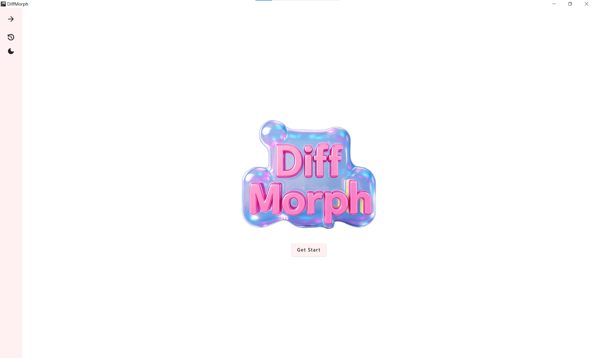
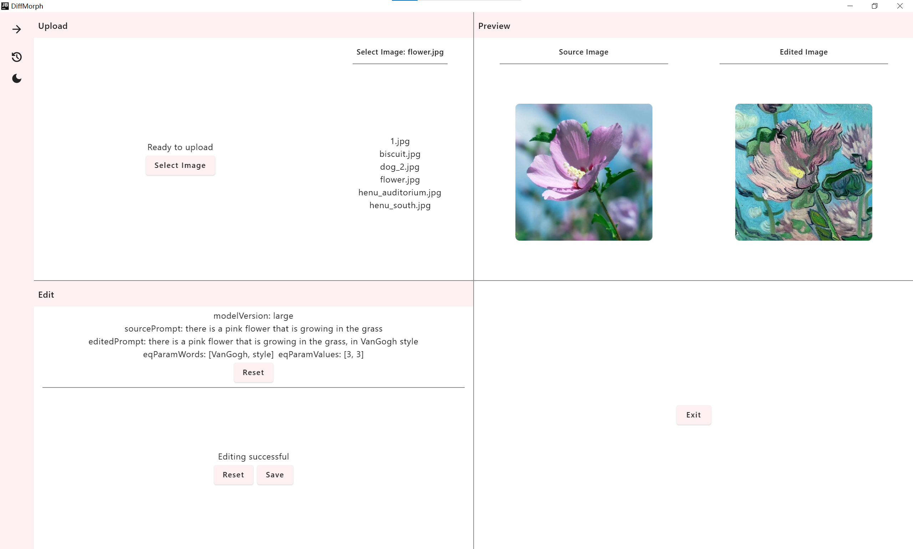

# diff-morph

Related: [diff-morph-torch](https://github.com/Osiris-tevin/diff-morph-torch).

## Run

- Desktop Gradle Run: `compsoeApp: run`

## Supported Platform

- desktop ✔
- ~~web~~
- ~~android~~

## Inspiration

### Sync KMP Web Dependencies

`./gradlew kotlinUpgradeYarnLock`

## Preview

